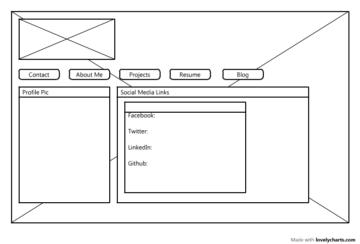
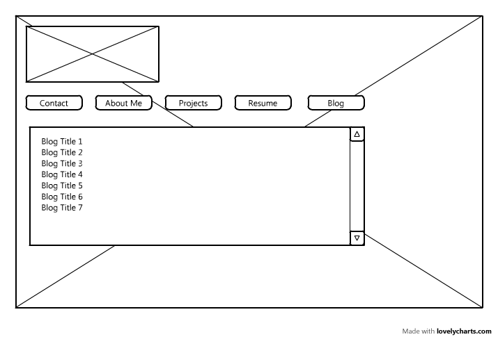

Wireframe is a simplified visual representation of the structure of a website. 

Wireframing helps developers and designers to learn about various aspects of designing a site, such as design vs. content and help them to get a sense of the technology and frameworks required to build the site. 

I did enjoy wireframing my site, and I revised my wireframe for several times. 

The question that I asked myself during this challenge is that "How can I make the user interface as clean as possible? Can I remove any more information that's unnecessary?" I googled some classic wireframe examples to answer the questions.

I found this entire challenge to be interesting.
