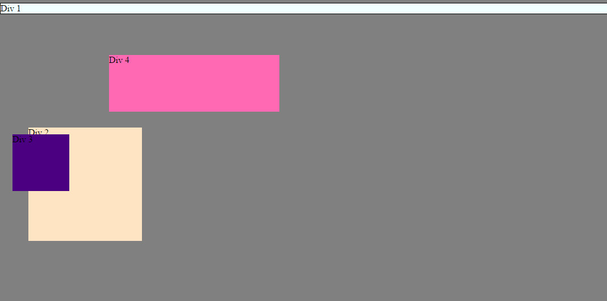
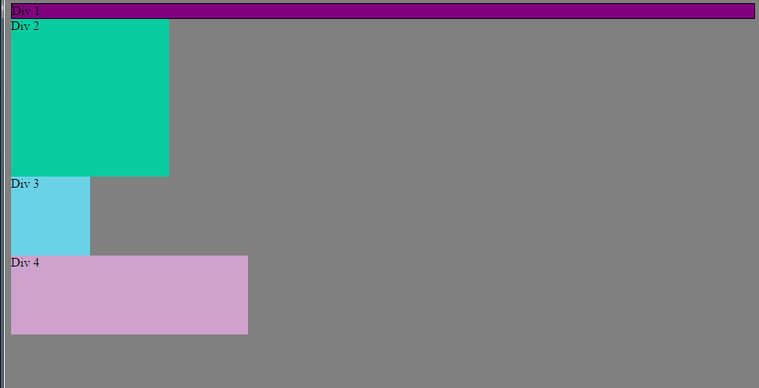
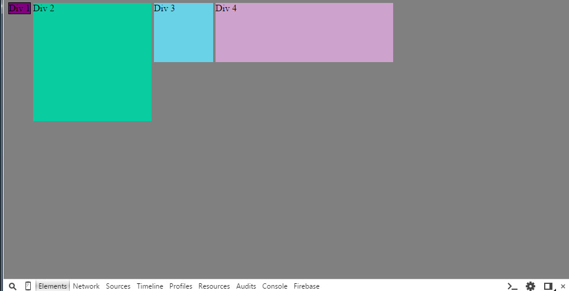
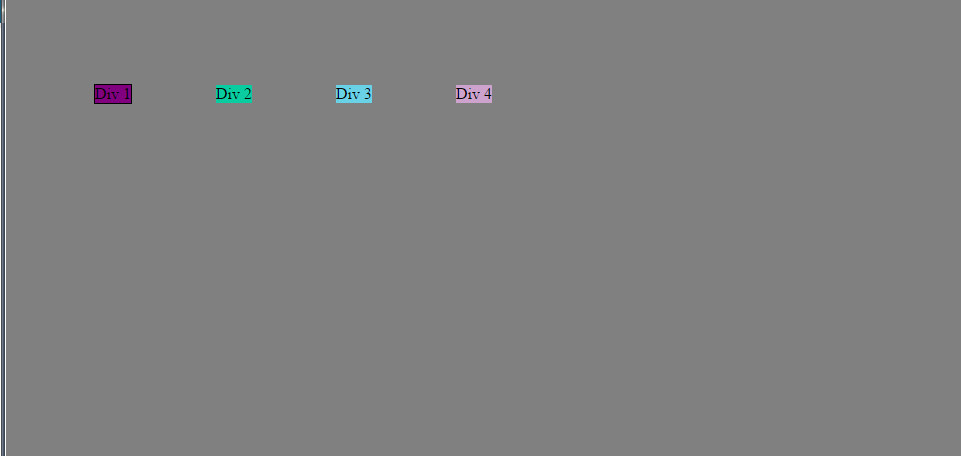
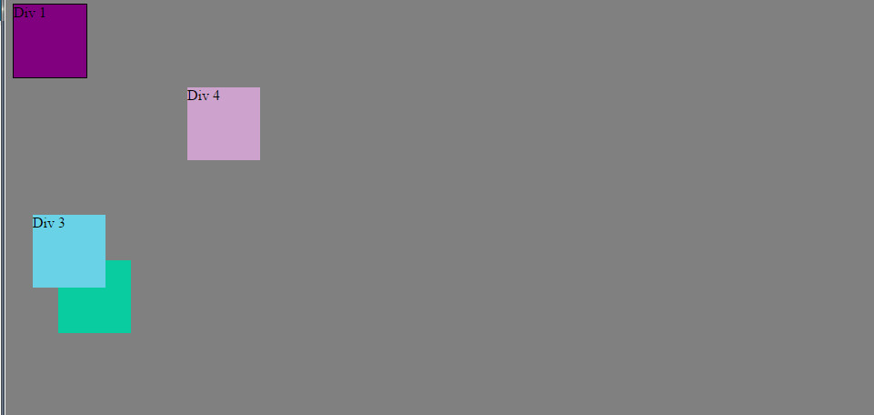
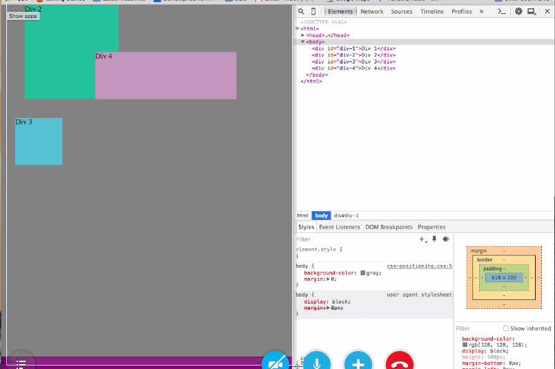
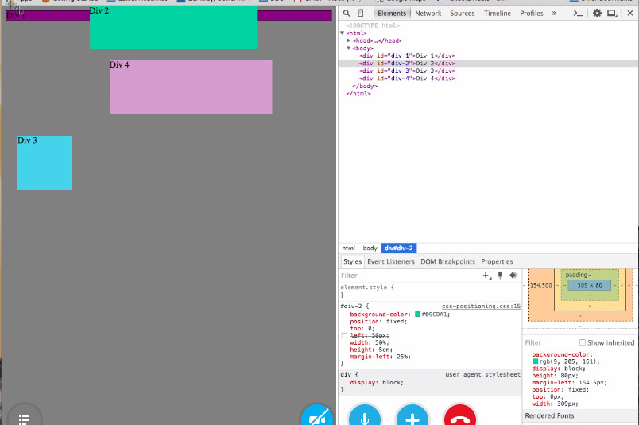
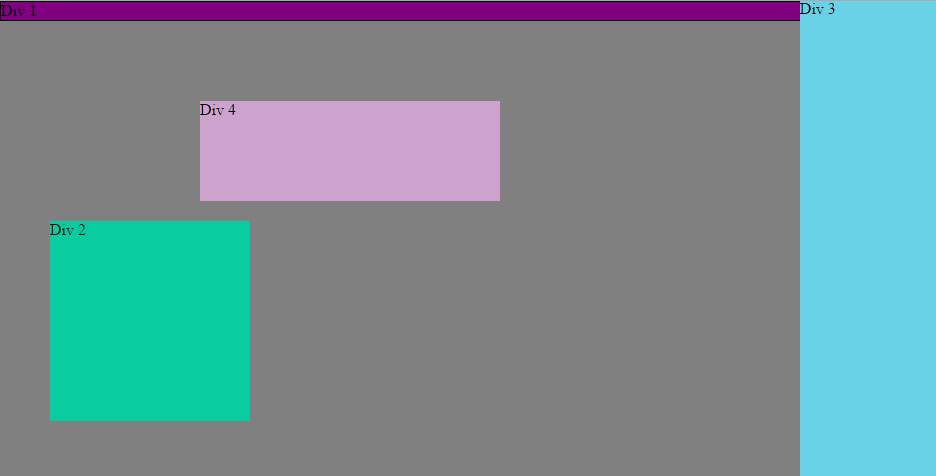

How can you use Chrome's DevTools inspector to help you format or position elements?
I can type in the window and get instant feedback from the browser, which allows me to do trail and error.

How can you resize elements on the DOM using CSS?
I can resize by using the width and height attributes.

What are the differences between Absolute, Fixed, Static, and Relative positioning? Which did you find easiest to use? Which was most difficult?
Absolute and fixed positioning takes the element out of the normal flow and positions it at specific locations on the page. Fixed positioning prevents the item from moving when scrolling while absolute positioning doesn't. Relative positioning leaves the item in the normal flow. Then, it applies positioning adjustments to the elements. Static positioning is the defualt positioning. 
I found relative positioning the easiest to use and absolute positioning being the most difficult. 

What are the differences between Margin, Border, and Padding?
From inside to outside, padding comes first, then comes border, then comes margin. Margin is on the most outside layers of the space that an element occupies, while padding is the inner space between content and border that an element takes up.
What was your impression of this challenge overall? (love, hate, and why?)
Easy.