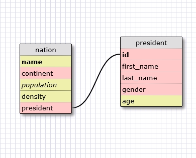
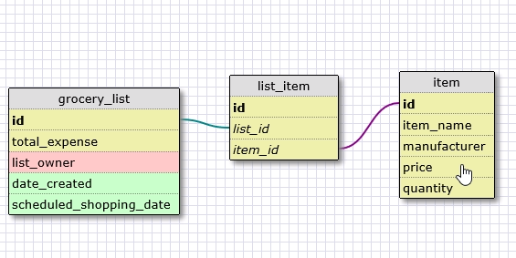

<!-- What is a one-to-one database? -->
<!-- one-to-one database represent information that can only match a single source and be matched by a single source. -->

<!-- When would you use a one-to-one database? (Think generally, not in terms of the example you created). -->
<!-- When the two objects can only be paired with each other exclusively. -->

<!-- What is a many-to-many database? -->
<!-- Many-to-many database represent relationships where each object can be connected with multiple instances of the other object. -->

<!-- When would you use a many-to-many database? (Think generally, not in terms of the example you created). -->
<!-- When both objects can be paired by multiple instances of the other object. -->

<!-- What is confusing about database schemas? What makes sense? -->
<!-- Little is confusing. -->	

