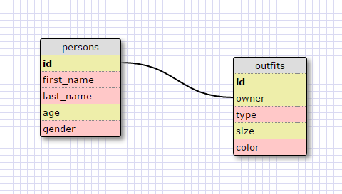

<!-- What are databases for? -->
<!-- databases are used to store information. -->

<!-- What is a one-to-many relationship? -->
<!-- When A belongs to B, but B has many A, A and B have a one-to-many relationship. -->

<!-- What is a primary key? What is a foreign key? How can you determine which is which? -->
<!-- A primary key distinguishes every entry in a table. A foreign key identifies a field that is  primary key in another table. -->

<!-- How can you select information out of a SQL database? What are some general guidelines for that? -->
<!-- You can select information out of a SQL database by using SELECT ...FROM ... statement. The general guideline is to capitalize the key phrases. -->

